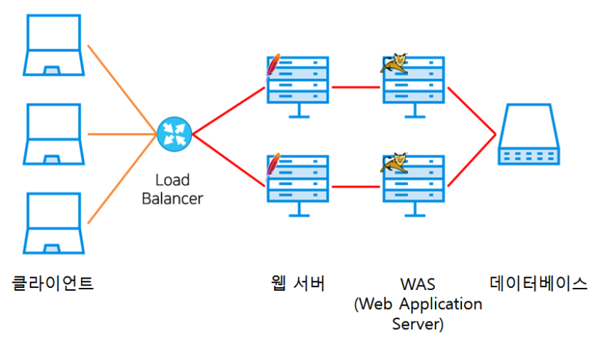
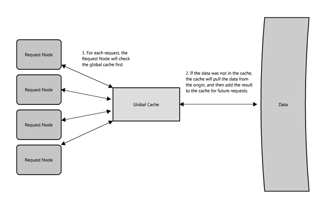
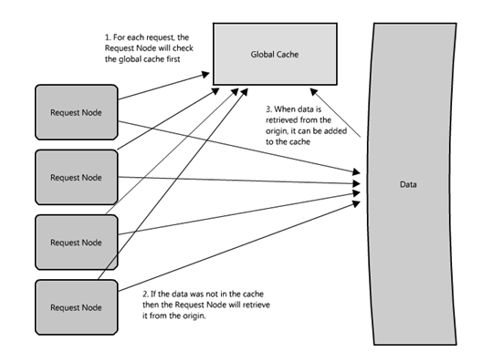

# 1주차 궁극의 아키텍쳐와 최적의 아키텍쳐는 존재하는 것일까??

- 건축가는 수련 시간 동안 수천 개의 건축물을 살펴보고 대가들이 작성한 건축 비평을 읽는다. 반면에 대부분의 소프트웨어 개발자는 프로그래밍할 때 사용하는 단지 몇 가지의 유용한 소프트웨어를 알고 있을 뿐이며 위대한 프로그램 역사를 공부하지 않는다. 

1. 가용성(Availability) : 시스템이 서비스를 정상적으로 제공할 수 있는 상태를 말한다.

2. 성능(Performance) : 빠른 응답시간, 낮은 레이턴시를 말한다.

3. 신뢰(Reliability) : 항상 같은 결과를 보장하는 것이다.

4. 확장(Scalability) : 추가적인 트래픽을 처리할 수 있는지, 저장 공간을 추가하기가 얼마나 쉬운지,

얼마나 더 많은 트랜잭션을 처리할 있는지이다.

5. 관리성(Manageability) : 쉽게 운용할 수 있는 시스템을 설계하는 것은 또 다른 중요한 고려 사항이다.

6. 비용(Cost) : 비용은 물론 하드웨어와 소프트웨어 비용을 포함하지만, 시스템을 배포하고 관리하는 비용 또한 고려된다. 시스템이 빌드하는 데 걸리는 시간, 시스템을 실행시키는 데 드는 운용 노력의 양, 모든 고려해야 할 사항에 대해서 필요한 교육 비용까지 포함된다. 즉 비용은 시스템 소유에 필요한 모든 비용이다.


* 시스템 아키텍처와 관련해서 고려해야 할 몇 가지 것이 있다. 무엇이 옳은 '부분'인지, 어떻게 해야 이러한 부분들이 잘 맞추어질지,
 그리고 무엇이 옳은 트레이드오프인지 등이다. 확장성이 필요하지도 않은데 확장성에 투자하는 것은 현명한 비즈니스가 아니다. 그러나 시스템 설계 시에 확장성을 미리 고려하는 것은 결과적으로 시간과 자원을 절약하는 데 도움이 될 것이다.

시스템 설계시 고려해야할 몇 가지가 있다.

무엇이 옳고, 틀린지 찾아 내는 것이 아니라

어떤 트레이드 오프가 발생하고 서비스와 맞는지

즉 최고 최적이 아닌 최선의 아키텍처를 구축한다.

예를 들면 확장성이 필요하지도 않는데 확장성에 투자하는 것은 현명은 비즈니스가 아니다.

그러나 확장성을 미리 구축한다면 결과적으로 추후 시간과 자원을 절약하는 데 도움이 될 것이다.

## 집약형

하나의 컴퓨터로 모든 처리를 한다. 

구성이 간단하고 성능이 잘나온다. 다만 비싸다.. 확장성도 떨어지고.. 점점 갈수록 느려지는..

## 분산형 아키텍쳐 

낮은 비용으로 시스템 구축이 가능하고 확장성이 좋다. 

관리가 어렵다..

- 수직 분할형 : 클라이언트-서버형으로 말한다. 이걸... 분산형이라고 말할수있나..?? 3계층형은 중간에 캐시서버를 구현하면 맞을 것 같다.

- 수평 분할형 : 용도가 같은 서버를 늘려나가는 방식이다. 

- 지리 분할형 : mmm / mha 와 같이 시스템 가용성 부분이다. 스탠바이형과 재해대책형

보통 스탠바이형을 사용한다고 볼수있다. 재해대책형은.. 클라우드로 변하면서 의미가 있을까..??

- https://jwdeveloper.tistory.com/215

- Load balancer에 문제가 생길 경우?

로드 밸런서를 DNS 다중화로 해결한다.

- WAS에 문제개 생겼을 경우 ?

다른 웹서버를 사용해야하고, 세션 클러스터링이 필요하다.

- 데이터베이스 문제가 생겼을 경우?

리플리케이션 mma mha

- https://jwdeveloper.tistory.com/215

### 전역 캐시와 분산 캐시 

전역 캐시는 말 그대로 모든 노드가 오직 하나의 캐시 공간만을 사용한다. 전역 캐시는 서버나 어떤 종류의 파일 저장소를 추가해도 잘 동작하고, 원래의 저장소보다 빠르며 모든 요청 레이어 노드에서 접근이 가능하다.

전역캐시를 사용하는 대부분의 애플리케이션은 같은 요청이 여러 요청 노드로부터 발생하는 것을 막기 위해 캐시 스스로가 데이터 축출과 조회를 직접하는 형태를 사용한다. -> 사용해본적이 없음..

분산 캐시는 보듯 각각의 노드가 캐시 데이터를 갖는 방식이다. 냉장고를 캐시, 그리고 식료품점을 저장 공간이라 비유해 보자. 그렇다면 분산 캐시는 식료품점에서 산 음식을 냉장고, 선반, 도시락과 같이 여러 곳에 나누어 두는 것과 유사하다. 가게에 갈 필요 없이 자주 먹는 것들을 집안에서 빠르게 찾는 것처럼 말이다. Like 샤딩 

분산 캐시의 단점은 장애가 발생한 노드를 처리하는 방법이 필요하다는 것이다. 다른 노드에 여러 개의 복제본을 가지는 방법으로 해결하기도 한다. 이런 방식을 사용하면 문제 노드를 처리하기 위한 로직이 복잡해지기 십상이다. 

### 큐 

큐의 장점은 클라이언트가 비동기 방식으로 동작할 수 있게 한다는 데에 있다. 클라이언트의 요청과 그것에 대한 응답 사이에 전략적 추상화를 제공하는 것이다. 반면 동기적인 시스템에서는 요청과 응답의 차이가 없기 때문에 각각이 분리되어 관리될 수 없다. 비동기 방식에서는 클라이언트는 작업을 요청하고 서비스는 요청을 잘 받았다는 ACK를 해당 클라이언트에 전해 준다. 그 다음 클라이언트는 결과를 받을 때까지 주기적으로 작업의 상태를 체크하다가, 결과 값이 생성되었다는 것을 알게 되면 결과 값을 요청하여 받는다

ex) kafka

## 수평 분할과 샤딩

수평 분할(Horizontal Partitioning)이란 스키마(schema)가 같은 데이터를 두 개 이상의 테이블에 나누어 저장하는 디자인을 말한다. 
가령 같은 주민 데이터를 처리하기 위해 스키마가 같은 '서현동주민 테이블'과 '정자동주민 테이블'을 사용하는 것을 말한다. 인덱스의 크기를 줄이고, 작업 동시성을 늘리기 위한 것이다. 보통 수평 분할을 한다고 했을 때는 하나의 데이터베이스 안에서 이루어지는 경우를 지칭한다.

사실 샤딩과 리플리케이션을 비교하지 않나..?

- 미들티어 샤딩 플랫폼

애플리케이션은 오직 샤딩 플랫폼과만 연결되어 있고 데이터베이스와 연결하는 것은 샤딩 플랫폼이 해야 할 일이다. 데이터베이스를 마이그레이션하여 교체하기 위하여 특정 샤드(shard, 분할된 DB 중 하나)에 복제 저장소를 추가하는 작업을 애플리케이션 서버의 재시작이나 변경 없이 할 수 있기 때문이다. 당연히 샤딩 플랫폼이 중단되면 애플리케이션 서버는 데이터베이스에 접근할 수 없게 된다. 때문에 샤딩 플랫폼 또한 이중화가 고려되어 있어야 한다.

미들티어이기 때문에 1 hop이 증가하여 그만큼의 네트워크 IO 시간이 필요하다는 것이다.

- 샤딩의 한계 

1. 두 개 이상의 샤드에 대한 JOIN 연산을 할 수 없다.
2. auto increment (serial) 등은 샤드별로 달라질 수 있다.
3. last_insert_id() 값은 유효하지 않다.
4. shard key column 값은 update하면 안 된다(delete - insert 사용).
5. 하나의 트랜잭션에서 두 개 이상의 샤드에 접근할 수 없다.

### 샤딩 

-  range-based sharding

특정 ID값을 기준으로, ID 범위에 따라 샤드를 나누는 방식입니다. 
ID값이 증가하는 추이를 보고서 새로운 샤드 추가가 쉽다는 장점이 있습니다. 반면에 디스크 사용량이나 쿼리 처리량의 밸런스가 많이 안 맞는 경우가 발생하기도 합니다.

- modulus-based sharding

[ID값] % [샤드 개수]의 결과 값으로 샤드 위치를 결정하는 방식입니다. Range 방식에 비해 리소스 사용 밸런스가 잘 맞다고 알려져 있습니다. 그러나 이 방식은 샤드 추가가 어렵습니다.

아래 그림과 같이 3개의 샤드에서 4개의 샤드로 확장을 하려면 기존의 각 샤드마다 데이터 재배치가 필요합니다. 현재 샤드 개수의 배수로 확장하면 그나마 쉽게 샤드 추가를 할 수 있지만, 만약 현재 샤드 개수가 수십~수백이라면 적지 않은 낭비가 발생할 수도 있습니다.

## 기타 

### Introduction of Kage

카카오의 대규모 분산 스토리지 시스템이다. 

1. 한 데이터를 3벌씩 3서버에 나누어 저장
2. 데이터 저장 시 커다란 청크 파일 하나에 데이터를 쓴 후, 데이터의 위치가 담긴 Kage-Key를 리턴
3. 발급받은 Kage-Key를 이용하여 저장된 데이터에 대한 읽기 및 수정이 가능.
4. 청크에는 Expire-Time이 존재하여 일정 시간이 지나면 청크에 담긴 파일이 모두 삭제

Kage 역시 보통의 분산 시스템처럼 파일을 저장할 때 복제본을 생성하여 물리적으로 다른 위치에 있는 3개의 저장소에 각각 저장합니다. 즉 원본 파일 외에도 2개의 복제본을 더 생성하여 총 3개의 파일을 저장하는 것인데, 이러한 정책을 통해 파일 읽기에 대한 트래픽을 분산시킬 수 있으며, 장애에 대한 유연한 처리도 가능해집니다. 만약 3개의 저장소 중 2개의 저장소에 장애가 발생하더라도, 나머지 하나의 저장소를 통해서 읽기 요청을 처리할 수 있습니다.

일반적인 쓰기의 경우 파일 이름, 내용, 그리고 저장 위치로 쓰기를 요청하는 반면, Kage의 경우 파일 이름과 내용만으로 쓰기를 요청하고 파일이 저장된 위치(KAGE_KEY)를 돌려받습니다.

전통적인 파일 시스템을 이용하는 NAS에서 파일을 읽게 되면 하나의 파일 읽기 요청에 대해서도 여러 번의 IO 오퍼레이션이 발생하게 됩니다. 파일 이름을 inode번호로 변환하고, inode를 디스크에서 읽고, 실제 파일내용을 디스크로 읽는 등의 과정을 거쳐야 합니다. 파일 시스템은 파일마다 메타정보(이름, 디렉토리 등)를 가지고 있고, 파일 개수가 많아질 수록 이러한 메타정보가 큰 병목이 됩니다.2 Kage는 커다란 파일(Chunk)에 순차적으로 데이터를 쓰고, Kage-Key를 통해 데이터의 논리적 위치를 구해내어 바로 접근하게 함으로써 이러한 병목 문제를 해결하였습니다.

Kage의 또 다른 재미있는 특징은 일정 시간이 지나면 파일이 자동으로 삭제되도록 설정할 수 있다는 것입니다. 카카오톡의 이미지, 비디오 전송을 위해서 개발이 시작되었기 때문에 일정 시간이 지나면 청크를 삭제하며 디스크를 끝없이 재활용할 수 있게 설계되었습니다.

- Hot vs Cold

Reactor 를 해본 사람이면 익숙한 hot / cold 

data에서는 많이 읽는 data를 hot, 인기가 식어버린 data를 cold라고 부른다. 

hot data는 트래픽을 감당하기 위해 2벌 정도 더 복제해서 저장한다 이는 부담이기 때문에 Cave곳에 보관한다. 

### 네이버의 이미지 호스팅 애플리케이션 

저장될 이미지의 개수에 제한이 없다. 따라서 저장공간의 확장성에 대해서도 고려해야 한다.
이미지 보기나 다운로드를 요청할 때 응답 시간이 빨라야 한다.
사용자가 이미지를 업로드하고 난 후, 해당 이미지는 항상 시스템에 저장되어 있어야 한다. (데이터에 대한 신뢰성)
시스템을 운용하기 쉬워야 한다(관리성)
이미지 호스팅 서비스 자체의 이익율이 높지 않기 때문에, 시스템은 비용 효율적으로 운용될 필요가 있다.

- 읽기 vs 쓰기 읽기'는 캐시의 도움을 받을 수 있지만 '쓰기' 요청은 결과적으로 디스크까지 도달해야 한다(그리고 eventual consistency 상황에서는 여러 번 쓰기가 발생할 것이다)

읽기와 쓰기를 분리한 형태의 서비스가 좋다. 

여러 핵심 이슈 중 하나는 데이터 로컬리티다. 
연산하려는 데이터가 가까이 위치해 있을 수록 시스템의 성능은 향상된다. 따라서 필요한 데이터를 여러 서버에 분산시키는 것은 로컬에 있지 않을 수 있는 데이터를 얻기 위해 비용이 높은 네트워크를 이용한 읽기가 발생할 수 있어 잠재적인 성능 문제가 발생할 수 있다.

또 다른 잠재적 이슈는 비정합성이다. 공유된 자원으로부터 읽기와 쓰기를 하는 서로 다른 서비스가 있다고 가정해 보자. 여기서는 경합조건이 발생할 가능성이 있다. 어떠한 데이터가 업데이트되려 할 때, 읽기 요청이 업데이트 요청보다 먼저 발생했다면 해당 데이터는 비정합성 상태가 된다. 

### 네이버 메인페이지의 분산 처리 기술 

- GCDN

: 
CSS와 JavaScript, 이미지와 같이 공통으로 호출되는 리소스는 한 번 업로드되면 잘 변하지 않는다. 이런 리소스를 네이버 메인 페이지의 웹 서버에서 직접 제공하면 트래픽 부하가 엄청나게 가중된다. 예를 들어 100KB 용량의 이미지를 10만 명이 조회하면 대략 10GB의 트래픽이 발생한다. 그래서 공통적으로 호출되는 리소스의 부하 분산을 위해 GCDN을 사용한다. 리소스를 GCDN으로 분산하면 네이버 메인 페이지의 트래픽을 상당히 절감할 수 있다.

또한, GCDN에서 지원하는 GSLB(Global Server LB) 기능은 접속한 IP 주소에서 가장 가까운 CDN 서버를 자동으로 선정해 연결하기 때문에 사용자가 빠른 서비스 속도를 체감할 수 있다.

- SSI

: SSI는 웹 서버(Apache, NGINX 등)에서 지원하는 서버사이드 스크립트 언어다. 서버에 있는 특정 파일을 읽어오거나 특정 쿠키 유무의 판별 등 간단한 기능을 실행할 수 있다. 이런 기능을 WAS에서만 실행할 수 있다고 생각하고 WAS에 요청을 보내는 경우가 많다. 하지만 SSI를 사용해 웹 서버에서 기능을 처리하면 WAS의 부담을 줄여 WAS의 성능에 여유를 줄 수 있게 되고, 웹 서버의 활용도도 높여 서버의 자원을 더 효율적으로 사용할 수 있다.
 

- 서킷 브레이커

: 서킷 브레이커는 외부 서비스의 장애로 인한 연쇄적 장애 전파를 막기 위해 자동으로 외부 서비스와 연결을 차단 및 복구하는 역할을 한다.

## Reference

- https://d2.naver.com/helloworld/14822
- https://d2.naver.com/helloworld/6070967
- https://d2.naver.com/helloworld/206816
- https://tech.kakao.com/2017/01/12/kage/
- https://tech.kakao.com/2016/07/01/adt-mysql-shard-rebalancing/

